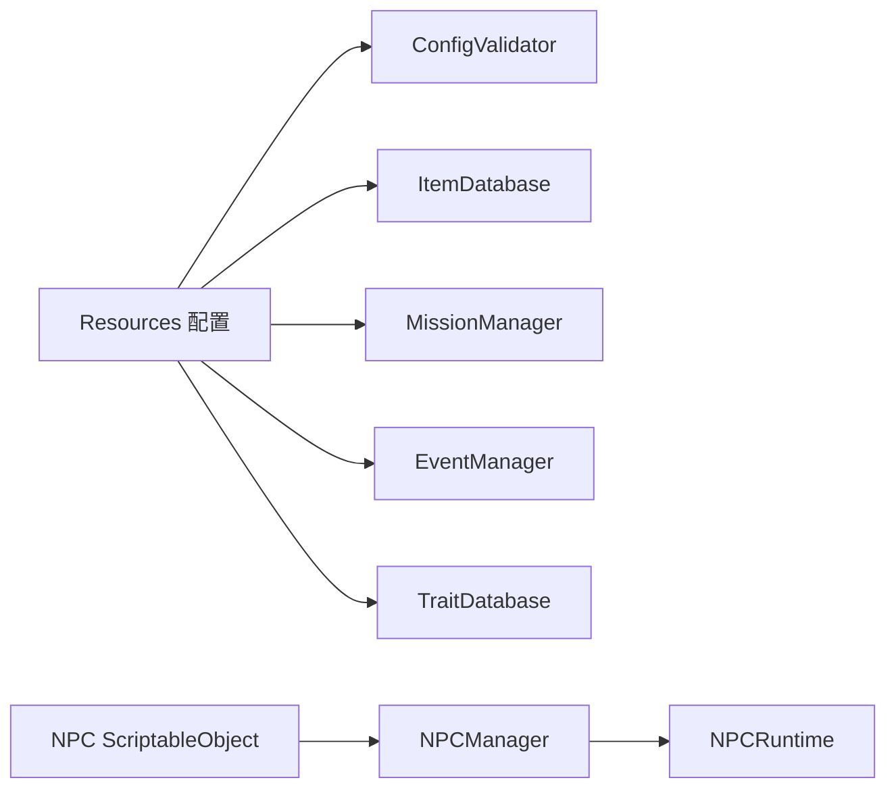
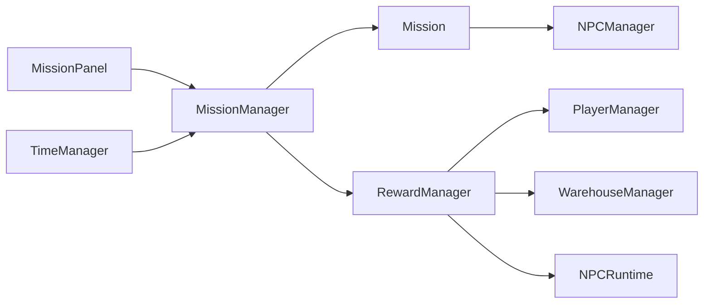

# Cultivation4X 项目架构

## 1. 项目概览

Cultivation4X 是一个使用 Unity 开发的单机修仙宗门经营原型。当前核心循环围绕弟子调度、任务推进、人物成长和条件随机事件展开：

```text
建设与宗门资源
    ↓
安排弟子执行任务或修炼
    ↓
按天推进角色、任务与事件
    ↓
获得修为、特质、关系、伤势和物品
    ↓
形成个人履历并影响后续事件
```

当前技术基线：

- Unity：2022.3.62f3 LTS
- UI：UGUI、TextMesh Pro
- 配置解析：Newtonsoft.Json 3.2.2
- 数据加载：Unity `Resources`
- 存档：JSON 文件，写入 `Application.persistentDataPath`
- 测试：Unity Test Framework EditMode 测试

## 2. 目录结构

```text
Assets/
├─ C#/
│  ├─ Data/       静态配置模型、存档模型和领域数据类型
│  ├─ Manager/    游戏系统入口、配置加载、调度和持久化
│  ├─ RunTime/    任务和 NPC 的运行时对象
│  ├─ UI/         UGUI 面板与显示逻辑
│  └─ Utility/    枚举、物品堆、成长规则等辅助类型
├─ Resources/
│  ├─ Configs/    物品、任务、人物事件和特质 JSON
│  ├─ NPC/        NPC ScriptableObject 模板
│  └─ Prefab/     UI Prefab
├─ Scenes/        Unity 场景
└─ Tests/Editor/  EditMode 自动化测试
```

项目当前没有自定义程序集定义，生产代码编译进 `Assembly-CSharp`，Editor 测试编译进 `Assembly-CSharp-Editor`。

## 3. 架构分层

### 3.1 配置与静态数据

- `NPCData`：ScriptableObject 人物模板，保存初始属性与性格特质。
- `ItemData`：JSON 物品定义。
- `MissionData`：JSON 任务定义，包括耗时、属性要求、节点和基础奖励。
- `EventDefinition`：条件人物事件定义，包括参与者、条件、选项、结果和效果。
- `TraitDefinition`：性格、经历和创伤特质定义。

配置由 `Resources.LoadAll` 加载。`ConfigValidator` 在启动时检查基础物品和任务配置；事件跨引用由 EditMode 测试进一步验证。

### 3.2 运行时领域模型

- `CharacterState`：可序列化的人物状态，是存档中的角色事实来源。
- `NPCRuntime`：将 `NPCData` 模板与 `CharacterState` 组合，并提供任务和 UI 使用的运行接口。
- `Mission`：单个活动任务的状态机实例。
- `ActiveCharacterEvent`：事件定义与本次参与角色绑定后的临时运行对象。
- `GameState`：完整存档快照。

静态模板和运行状态必须保持分离。存档使用稳定字符串 ID，不直接保存 Unity 对象引用。

### 3.3 系统协调层

| 系统 | 主要职责 |
|---|---|
| `TimeManager` | 推进游戏天数，规定每日系统执行顺序 |
| `NPCManager` | 创建、查询和恢复角色；处理状态、关系、受伤、死亡与招募 |
| `MissionManager` | 加载任务模板；创建、推进、结算和恢复活动任务 |
| `EventManager` | 加载条件事件；筛选、绑定、加权抽取、结算和安排后续事件 |
| `TraitDatabase` | 加载并查询特质定义 |
| `ItemDatabase` | 加载并查询物品定义 |
| `WarehouseManager` | 管理宗门库存及物品增减 |
| `PlayerManager` | 管理宗门金币、声望和设施等级 |
| `RewardManager` | 将任务奖励分发到宗门资源、人物成长和仓库 |
| `SaveManager` | 捕获、保存和恢复完整 `GameState` |
| `UIManager` | 管理 UI 面板显示与关闭栈 |

多数 Manager 仍采用 Unity 单例。`EventManager`、`TraitDatabase`、`SaveManager` 和人物事件 UI 使用运行时启动方法自动创建，其余系统主要由场景对象提供。

## 4. 核心数据流

### 4.1 启动与配置加载



### 4.2 每日推进

`TimeManager.EndDay()` 是每日结算入口，当前顺序为：

1. 当前天数加一。
2. `NPCManager` 推进伤势、状态和空闲修炼。
3. 广播 `OnDayPassed`，由 `MissionManager` 推进活动任务。
4. `EventManager` 处理到期后续事件或抽取新事件。
5. `SaveManager` 自动保存。

这个顺序属于高风险约束。更改顺序可能改变任务结算、事件条件和存档结果。

### 4.3 任务流程



任务状态使用 `MissionState`：`NotStarted → Active ↔ WaitingNode → Completed/Failed`。任务成功、失败、角色死亡和读档恢复都必须同步清理或恢复角色的 `CurrentMission`。

### 4.4 人物事件流程

1. `EventManager` 根据冷却、次数和全局条件收集候选事件。
2. 根据参与者规则绑定存活角色。
3. 特质可以改变事件权重或可用选项。
4. 玩家通过 `CharacterEventPanel` 选择选项。
5. 系统使用可复现随机状态选择结果。
6. `EventEffect` 修改宗门、人物、关系、伤势、死亡或后续事件队列。
7. 结果写入事件历史和人物履历，然后自动保存。

后续事件通过 `PendingEvent` 保存到指定日期。事件配置不得直接持有 `NPCRuntime` 或 Unity 对象。

## 5. 人物养成模型

`CharacterState` 当前包含：

- 稳定角色 ID 与模板 ID
- 姓名、年龄、等级和经验
- 修为与三个境界：炼气、筑基、金丹
- 活动状态与剩余天数
- 健康状态：健康、轻伤、重伤、永久创伤、死亡
- 性格和经历特质 ID
- 关系标签记录
- 个人履历

关系当前是离散标签：师徒、好友、仇敌、救命恩人，没有连续好感度。

角色死亡后仍保留在存档和关系记录中，但不能再接受任务或被普通事件绑定。最后一名存活弟子受到坏档保护，致命结果会转化为永久创伤。

## 6. 存档架构

`SaveManager` 将以下状态写入版本化 `GameState`：

- 当前天数
- 确定性随机种子和抽取次数
- 宗门资源与设施等级
- 仓库
- 全部人物状态，包括死亡人物
- 活动任务及其动态奖励
- 事件历史
- 待触发后续事件

存档版本由 `SaveDataVersion.Current` 控制。新增字段应提供安全默认值；删除、重命名字段或改变字段语义前必须设计迁移策略。

## 7. UI 架构

UI 面板通过 Manager 查询数据和发送玩家命令：

- `SectPanel`、`NPCSlotUI`、`NPCInfoPanel`：人物列表与详情。
- `MissionPanel`、`NPCSelectPanel`：选择任务和执行者。
- `MissionNodePanel`：处理任务节点选项。
- `CharacterEventPanel`：显示人物事件和选项；当前由运行时自动创建基础界面。
- `WarehousePanel`、`ItemSlotUI`、`ItemInfoPanel`：仓库与物品详情。
- `UIManager`：统一打开、关闭和 Esc 返回。

当前 UI 仍直接依赖全局 Manager，尚未形成独立展示模型或统一数据绑定层。

## 8. 测试与验证

`Assets/Tests/Editor/CharacterStateTests.cs` 当前覆盖：

- 特质去重
- 死亡状态判定
- 履历来源记录
- `GameState` JSON 往返及随机状态保存
- 人物事件 ID 与后续事件、特质、物品、NPC 模板的跨配置引用

合入功能前至少应执行：

1. Unity 脚本编译。
2. EditMode 测试。
3. `git diff --check`。
4. 手动验证“推进日期 → 处理事件 → 保存 → 重新读取”。

## 9. 已知边界与技术风险

- `RandomEventManager` 是旧任务式随机事件系统，`EventManager` 是新人物条件事件系统；两套系统仍然并存。
- 单例初始化依赖 Unity 生命周期，新增 Manager 可能导致顺序风险。
- `Resources` 适合当前原型，但内容规模扩大后需要评估加载和校验工具。
- 事件和特质效果仍依赖字符串 ID，必须通过配置验证防止静默错误。
- 当前自动化主要覆盖数据层，场景引用、Prefab 和完整 PlayMode 流程仍依赖人工验证。
- `SampleScene` 是目前唯一主场景，场景与 Prefab GUID 变更属于高风险操作。
- 项目根目录的 `.vs` 已被旧提交纳入 Git；它是机器生成状态，不应继续进入功能提交，后续应单独清理并加入 `.gitignore`。

## 10. 扩展规则

新增功能时优先遵循以下方向：

- 新角色状态进入 `CharacterState`，并同步考虑存档兼容。
- 新内容优先使用现有事件条件和效果；只有无法表达明确玩法时才扩展枚举。
- 新任务状态必须补充成功、失败、取消、死亡和读档路径。
- 新事件引用必须进入配置测试。
- UI 不直接修改公开集合，应通过 Manager 提供的命令接口改变状态。
- 不为单个功能新增全局 Manager；优先扩展现有领域边界。

具体协作、风险审批和变更预算以项目根目录的 `AGENTS.md` 为准。
